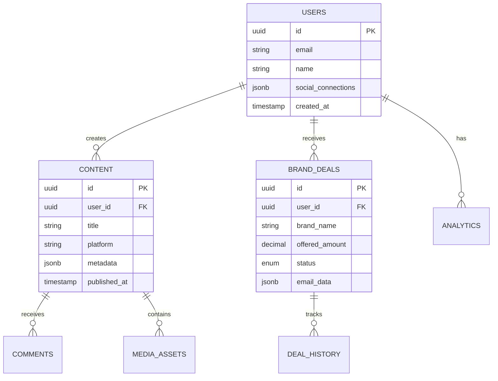

# ContentStudio AI - System Design Document

**A comprehensive technical blueprint for an AI-powered content creation platform**

## 1. High-Level System Architecture

```mermaid
flowchart TB
    subgraph CLIENT["👤 Client Layer"]
        direction LR
        WEB["🌐 Next.js Web App"]
        PWA["📱 Mobile PWA"]
    end

    subgraph GATEWAY["🚪 API Gateway Layer"]
        direction LR
        REST["REST API<br/>(Next.js Routes)"]
        WS["WebSocket Server<br/>(Socket.io)"]
    end

    subgraph CORE["⚙️ Core Services Layer"]
        direction TB
        AUTH["🔐 Auth Service"]
        USER["👤 User Service"]
        VIDEO["🎬 Video Service"]
        ENGAGE["💬 Engagement Service"]
        BRAND["💼 Brand Deal Service"]
        ANALYTICS["📊 Analytics Service"]
    end

    subgraph QUEUE["📬 Message Queue Layer"]
        REDIS["Redis<br/>(BullMQ)"]
    end

    subgraph AI["🤖 AI Workers Layer"]
        direction TB
        subgraph MEDIA_AI["Media Processing"]
            WHISPER["Whisper V3<br/>(STT)"]
            FISH["Fish Speech<br/>(TTS)"]
            SD["Stable Diffusion<br/>(Thumbnails)"]
            FFMPEG["FFmpeg<br/>(Video Ops)"]
        end
        subgraph INTEL_AI["Intelligence"]
            LLM["DeepSeek-R1<br/>(LLM)"]
            YOLO["YOLOv11<br/>(Vision)"]
            BERT["BERT<br/>(Sentiment)"]
            QWEN["Qwen2.5-VL<br/>(Documents)"]
        end
    end

    subgraph DATA["💾 Data Layer"]
        direction LR
        PG[("PostgreSQL<br/>(Relational)")]
        PINE[("Pinecone<br/>(Vectors)")]
        S3[("AWS S3<br/>(Media)")]
    end

    CLIENT --> GATEWAY
    GATEWAY --> CORE
    CORE --> QUEUE
    QUEUE --> AI
    AI --> DATA
    CORE --> DATA
```

**Reference**: Our architecture follows the microservices decomposition pattern

---

## 2. User Journey Maps

### 2.1 Creator Onboarding Journey

### 2.2 Content Creation Flow Map

```mermaid
flowchart LR
    subgraph INPUT["📥 Input"]
        UPLOAD["Upload Video"]
        RECORD["Record New"]
        IMPORT["Import from URL"]
    end

    subgraph PROCESS["⚙️ AI Processing"]
        direction TB
        TRANSCRIBE["🎤 Transcribe Audio"]
        ANALYZE["🔍 Analyze Content"]
        DETECT["🎯 Detect Key Moments"]
    end

    subgraph GENERATE["✨ AI Generation"]
        direction TB
        SHORTS["📱 Generate Shorts"]
        SUBS["📝 Generate Subtitles"]
        THUMBS["🖼️ Generate Thumbnails"]
        VOICE["🗣️ Generate Voiceover"]
    end

    subgraph OUTPUT["📤 Output"]
        direction TB
        PREVIEW["👁️ Preview"]
        EDIT["✏️ Edit/Refine"]
        EXPORT["⬇️ Export"]
        PUBLISH["🚀 Publish"]
    end

    INPUT --> PROCESS
    PROCESS --> GENERATE
    GENERATE --> OUTPUT

    EXPORT --> LOCAL["Local Download"]
    PUBLISH --> YOUTUBE["YouTube"]
    PUBLISH --> TIKTOK["TikTok"]
    PUBLISH --> INSTA["Instagram"]
    PUBLISH --> LINKEDIN["LinkedIn"]
```

---

## 3. Feature Mind Map

---

## 4. State Flow Diagrams

### 4.1 Video Processing State Machine

### 4.2 Brand Deal State Machine

---

## 5. Technology Stack

**Reference**: Next.js full-stack architecture pattern

### 5.1 Frontend & User Interface

| Component | Technology | Purpose |
|-----------|------------|---------|
| **Framework** | Next.js 15+ (App Router) | High-performance SSR, SEO optimization |
| **Styling** | Tailwind CSS | Rapid UI development |
| **Component Library** | Shadcn/UI | Consistent, professional components |
| **State Management** | Zustand | Lightweight state for video editing |
| **Data Visualization** | Recharts / D3.js | Analytics dashboard charts |
| **Text Editor** | TipTap | Text-based video editing interface |
| **Real-Time Collaboration** | Hocuspocus (Yjs-based) | Multi-user editing sync |

---

### 2.2 Backend & Core Infrastructure

| Component | Technology | Purpose |
|-----------|------------|---------|
| **Runtime** | Node.js 22+ | High-concurrency environment |
| **Framework** | Next.js 15+ API Routes | Seamless frontend-backend integration |
| **Real-Time** | Socket.io (WebSockets) | Live collaboration, status updates |
| **Message Broker** | Redis | Caching, state sync, task queuing |
| **Task Queue** | BullMQ (Redis-backed) | Long-running AI/video processing jobs |

---

### 2.3 Database Architecture

| Database | Technology | Purpose |
|----------|------------|---------|
| **Primary DB** | PostgreSQL | User data, analytics, brand deals, structured content |
| **Vector DB** | Pinecone | RAG for brand intelligence, content semantic search |
| **Object Storage** | AWS S3 | Raw videos, generated assets, model weights |

---

## 3. AI/ML Core Services

**Reference**: AI Pipeline Architecture for Media Processing

### 3.1 Video & Audio Production

| Capability | Model | Deployment | Notes |
|------------|-------|------------|-------|
| **Speech-to-Text** | OpenAI Whisper V3 (Large) | Self-hosted GPU | Multilingual subtitles, text-based editing |
| **Text-to-Speech** | Fish Speech V1.5 / XTTS v2 | Self-hosted GPU | High-fidelity AI voices, voice cloning |
| **Thumbnail Generation** | Stable Diffusion 3.5 Large / FLUX.2 | Self-hosted GPU | Scene-aware, emotion-aware |
| **Video Processing** | FFmpeg + MoviePy | Container-based | Clipping, aspect ratio, merging |

### 3.2 Content Intelligence

| Capability | Model | Purpose |
|------------|-------|---------|
| **LLM Core** | DeepSeek-R1 / Llama 3.3 (70B) | Viral hooks, email analysis, negotiation replies |
| **Trend Forecasting** | Prophet / NeuralProphet | Time-series engagement prediction |
| **Visual Analysis** | YOLOv11 | Detect viral visual triggers, auto-thumbnail frames |

### 3.3 Brand & Engagement Intelligence

| Capability | Model | Purpose |
|------------|-------|---------|
| **Document Analysis** | Qwen2.5-VL | Scan PDF contracts, extract email terms |
| **Agentic Framework** | LangGraph / CrewAI | Autonomous auto-replies, negotiation logic |
| **Sentiment Analysis** | BERT / Fine-tuned RoBERTa | Comment categorization, moderation |

---

## 6. AWS Cloud Architecture

| AWS Service | Purpose |
|-------------|---------|
| **EC2 G6/P5** | Model training, heavy inference (NVIDIA H100/L40S) |
| **Inferentia Inf2** | Cost-efficient LLM inference |
| **S3** | Raw videos, generated assets, model weights |
| **EKS** | Kubernetes orchestration for AI microservices |
| **Elemental MediaConvert** | Final heavy-duty transcoding (optional) |
| **RDS** | Managed PostgreSQL |

**Reference**: AWS EKS Container Orchestration Pattern

---

## 5. Service Architecture

### 5.1 Microservices Overview

### 5.2 Service Responsibilities

| Service | Responsibilities |
|---------|------------------|
| **API Gateway** | Request routing, auth, rate limiting |
| **Collaboration Service** | Real-time sync (Yjs/Hocuspocus), WebSocket management |
| **Video Processing** | Upload handling, FFmpeg operations, shorts generation |
| **Audio Processing** | STT transcription, TTS generation |
| **Thumbnail Service** | Frame extraction, SD image generation |
| **Analytics Service** | Metrics aggregation, trend prediction |
| **Brand Deal Service** | Email parsing, deal classification, negotiation |
| **Engagement Service** | Comment analysis, auto-replies |

---

## 6. Data Flow Diagrams

### 6.1 Video-to-Shorts Pipeline

```mermaid
sequenceDiagram
    participant U as User
    participant API as API Gateway
    participant Q as Task Queue
    participant W as Whisper Worker
    participant V as Vision Worker
    participant F as FFmpeg Worker
    participant S3 as AWS S3

    U->>API: Upload Long-Form Video
    API->>S3: Store Raw Video
    API->>Q: Queue Processing Job
    Q->>W: Extract Audio → Transcribe
    W-->>Q: Transcript + Timestamps
    Q->>V: Analyze Frames (YOLO)
    V-->>Q: Key Moments + Viral Triggers
    Q->>F: Generate Clips
    F->>S3: Store Shorts
    F-->>API: Return Short URLs
    API-->>U: Shorts Ready
```

### 8.2 Brand Deal Analysis Flow

### 8.3 Comment Management Flow

```mermaid
flowchart TB
    subgraph INPUT["📥 Comment Stream"]
        YT["YouTube API"]
        IG["Instagram API"]
        TT["TikTok API"]
    end

    subgraph PROCESS["⚙️ Processing"]
        FETCH["Fetch Comments"]
        BERT["BERT Sentiment Analysis"]
        CLASSIFY{"Classification"}
    end

    subgraph CATEGORIES["📊 Categories"]
        POS["✅ Positive"]
        NEU["➖ Neutral"]
        NEG["❌ Negative"]
        SPAM["🚫 Spam"]
    end

    subgraph ACTIONS["🤖 Actions"]
        HIDE["Hide/Delete"]
        AUTO["Auto Reply"]
        FLAG["Flag for Review"]
        NOTIFY["Notify Creator"]
    end

    INPUT --> FETCH
    FETCH --> BERT
    BERT --> CLASSIFY
    CLASSIFY --> POS & NEU & NEG & SPAM
    POS --> AUTO
    NEU --> FLAG
    NEG --> NOTIFY
    SPAM --> HIDE
```

### 8.4 Analytics Data Pipeline

```mermaid
flowchart LR
    subgraph SOURCES["📡 Data Sources"]
        direction TB
        YT_API["YouTube Analytics"]
        IG_API["Instagram Insights"]
        TT_API["TikTok Analytics"]
        INT["Internal Events"]
    end

    subgraph INGEST["📥 Ingestion"]
        COLLECT["Data Collector"]
        TRANSFORM["ETL Transform"]
    end

    subgraph STORE["💾 Storage"]
        TIMESERIES[("Time Series Data")]
        AGGREGATE[("Aggregated Metrics")]
    end

    subgraph ANALYZE["🧠 Analysis"]
        PROPHET["Prophet Forecasting"]
        TRENDS["Trend Detection"]
        COMPARE["Competitor Analysis"]
    end

    subgraph OUTPUT["📊 Outputs"]
        DASH["Dashboard"]
        ALERTS["Alerts"]
        REPORTS["Reports"]
        RECS["Recommendations"]
    end

    SOURCES --> INGEST
    INGEST --> STORE
    STORE --> ANALYZE
    ANALYZE --> OUTPUT
```

---

## 7. Real-Time Collaboration Architecture

| Component | Technology | Purpose |
|-----------|------------|---------|
| **Client Editor** | TipTap | Rich text + video timeline editing |
| **CRDT Layer** | Yjs | Conflict-free replicated data types |
| **Sync Server** | Hocuspocus | WebSocket-based sync server |
| **State Broadcast** | Redis Pub/Sub | Multi-instance state sync |

---

## 8. Security Design

### 8.1 Authentication Flow

### 8.2 Security Measures

| Layer | Measure |
|-------|---------|
| **Transport** | TLS 1.3 encryption |
| **Authentication** | OAuth 2.0 (Google, GitHub, etc.) |
| **Authorization** | Role-based access control (RBAC) |
| **API Security** | Rate limiting, request validation |
| **Data at Rest** | AES-256 encryption (S3, RDS) |
| **Secrets** | AWS Secrets Manager |

---

## 9. Scalability Strategy

### 9.1 Horizontal Scaling

| Component | Strategy |
|-----------|----------|
| **API Servers** | Auto-scaling behind ALB |
| **AI Workers** | Queue-based scaling (more jobs = more workers) |
| **WebSocket Servers** | Sticky sessions + Redis Pub/Sub |
| **Database** | Read replicas for analytics queries |

### 9.2 Performance Optimizations

| Optimization | Implementation |
|--------------|----------------|
| **CDN** | CloudFront for static assets and generated media |
| **Caching** | Redis for API responses, user sessions |
| **Lazy Loading** | Defer AI model loading until first use |
| **Batch Processing** | Combine multiple small jobs into batches |

---

## 10. Deployment Architecture

### 10.1 CI/CD Pipeline

| Stage | Tools | Actions |
|-------|-------|---------|
| **Build** | GitHub Actions | Lint, test, build Docker images |
| **Test** | Jest, Playwright | Unit tests, E2E tests |
| **Scan** | Trivy, Snyk | Security vulnerability scanning |
| **Deploy** | ArgoCD / Helm | GitOps deployment to EKS |
| **Monitor** | CloudWatch, Grafana | Performance and error monitoring |

---

## 11. API Design

### 11.1 Core Endpoints

| Method | Endpoint | Description |
|--------|----------|-------------|
| `POST` | `/api/v1/videos/upload` | Upload video for processing |
| `POST` | `/api/v1/videos/:id/shorts` | Generate shorts from video |
| `GET` | `/api/v1/analytics/dashboard` | Get analytics dashboard data |
| `POST` | `/api/v1/deals/analyze` | Analyze brand deal email |
| `GET` | `/api/v1/comments` | Get categorized comments |
| `POST` | `/api/v1/thumbnails/generate` | Generate thumbnail options |

### 11.2 WebSocket Events

| Event | Direction | Description |
|-------|-----------|-------------|
| `editor:update` | Bidirectional | Real-time document changes |
| `processing:progress` | Server → Client | Video processing status |
| `comment:new` | Server → Client | New comment notification |

---

## 12. Monitoring & Observability

| Aspect | Tools | Purpose |
|--------|-------|---------|
| **Metrics** | CloudWatch, Prometheus | System and application metrics |
| **Logging** | CloudWatch Logs, Loki | Centralized log aggregation |
| **Tracing** | AWS X-Ray | Distributed request tracing |
| **Alerting** | CloudWatch Alarms, PagerDuty | Incident notification |
| **Dashboards** | Grafana | Visualization and analysis |

---

## 13. Cost Optimization

| Strategy | Implementation |
|----------|----------------|
| **Spot Instances** | Use for non-critical AI workers |
| **Inferentia** | Use Inf2 for LLM inference (cheaper than GPU) |
| **S3 Lifecycle** | Move old media to Glacier after 90 days |
| **Reserved Capacity** | Reserve baseline compute capacity |
| **Auto-Scaling** | Scale down during off-peak hours |

---

## 14. Future Considerations

- **Multi-Region Deployment** for global low-latency access
- **Edge Inference** using AWS Wavelength for real-time features
- **Custom Model Fine-Tuning** pipeline for niche-specific improvements
- **Plugin Marketplace** for third-party extensions
- **White-Label Solution** for enterprise/agency clients
